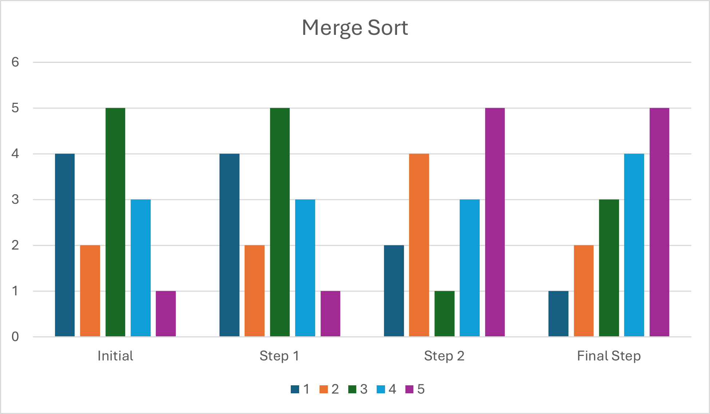
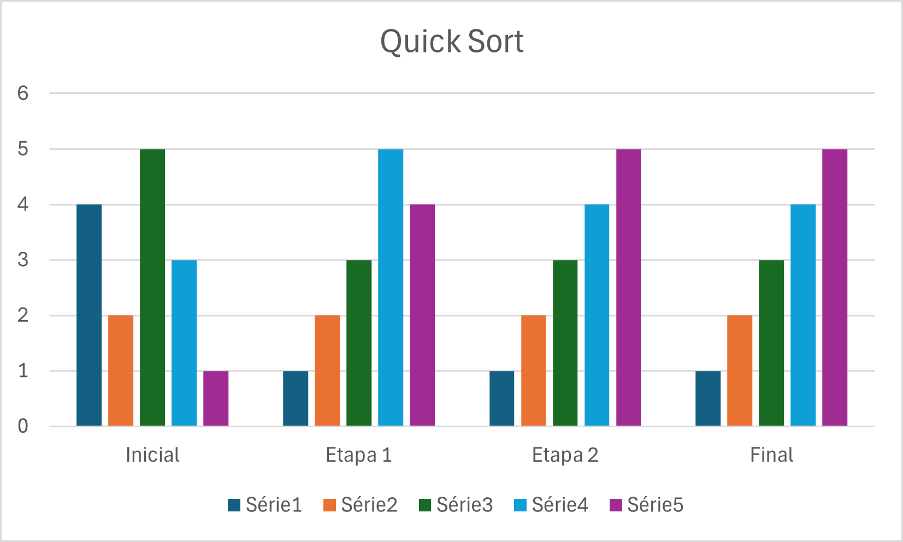
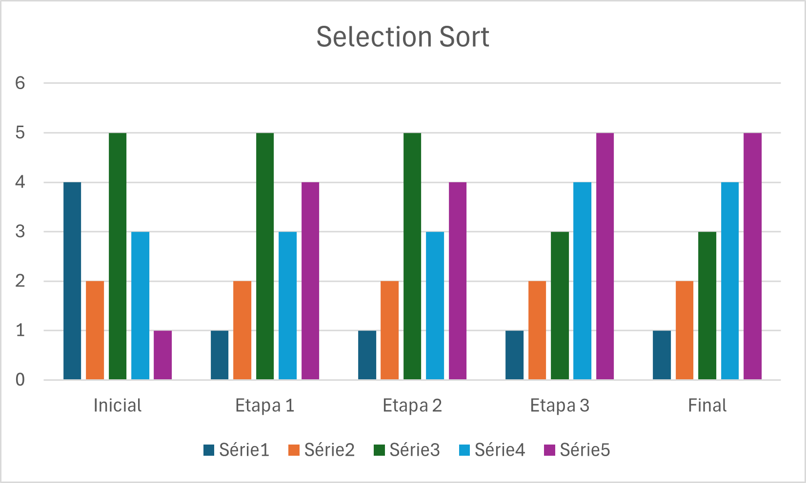

# Search & Sort Algorithms

This repository contains a series of implementations of search and sorting algorithms that are part of a study for the Data Structures course. Below are the descriptions of the implemented algorithms, performance comparisons, and usage examples.

# Search Algorithms
- Binary Search
- Interpolation Search
- Jump Search
- Exponential Search
- Ternary Search

# Sort Algorithms

- Shell Sort
  - Shell
  - Knuth
  - Hibbard
- Merge Sort
- Selection Sort
- Bucket Sort
- Radix Sort
  - Base 10
  - Base 2
- Quick Sort
  - First Pivot
  - Middle Pivot
  - Last Pivot

# Search Algorithm

#### Time Comparison & Complexity

<table>
 <tr>
  <td colspan="4" style="text-align: center;">Time Comparison</td>
  <td colspan="3" style="text-align: center;">Time Complexity</td>
 </tr>
 <tr>
   <td>Algorithm</td>
   <td>Execution Time - Small List</td>
   <td>Execution Time - Medium List</td>
   <td>Execution Time - Big List</td>
   <td>Best Case</td>
   <td>Medium Case</td>
   <td>Worst Case</td>
   <td>Space Complexity</td>
 </tr>
 <tr>
   <td>Binary Search</td>
   <td>0,012787</td>
   <td>0,000107</td>
   <td>0,000048</td>
   <td>O(1)</td>
   <td>O(log n)</td>
   <td>O(log n)</td>
   <td>O(1)</td>
 </tr>
 <tr>
   <td>Interpolation Search</td>
   <td>0,000244</td>
   <td>0,000199</td>
   <td>0,000197</td>
   <td>O(1)</td>
   <td>O(n)</td>
   <td>O(log(log n))</td>
   <td>O(1)</td>
 </tr>
 <tr>
   <td>Jump Search</td>
   <td>0,000422</td>
   <td>0,000100</td>
   <td>0,000073</td>
   <td>O(√n)</td>
   <td>O(√n)</td>
   <td>O(√n)</td>
   <td>O(1)</td>
 </tr>
 <tr>
   <td>Exponential Search</td>
   <td>0,000265</td>
   <td>0,000068</td>
   <td>0,000174</td>
   <td> O(1)</td>
   <td>O(log n)</td>
   <td>O(log n)</td>
   <td>O(1)</td>
 </tr>
 <tr>
   <td>Ternary Search</td>
   <td>0,000243</td>
   <td>0,000178</td>
   <td>0,000096</td>
   <td> O(1)</td>
   <td>O(log₃ n)</td>
   <td>O(log₃ n)</td>
   <td>O(1)</td>
 </tr>
</table>

# Sort Algorithm

#### Time & Comparison Complexity

<table>
 <tr>
  <td colspan="4" style="text-align: center;">Time Comparison</td>
  <td colspan="3" style="text-align: center;">Time Complexity</td>
 </tr>
 <tr>
   <td>Algorithm</td>
   <td>Execution Time</td>
   <td colspan="2">Comparison Number</td>
   <td>Best Case</td>
   <td>Medium Case</td>
   <td>Worst Case</td>
   <td>Space Complexity</td>
 </tr>
 <tr>
   <td>Shell Sort (Knuth)</td>
   <td>0.000007</td>
   <td colspan="2">40</td>
   <td>O(n log n)</td>
   <td>-</td>
   <td>O(n^(3/2)</td>
   <td>O(1)</td>
 </tr>
 <tr>
   <td>Shell Sort (Shell)</td>
   <td>0.000008</td>
   <td colspan="2">36</td>
   <td>O(n log n)</td>
   <td>O(n^(3/2))</td>
   <td>O(n²)</td>
   <td>O(1)</td>
 </tr>
 <tr>
   <td>Quick Sort (Middle Pivot)</td>
   <td>0.000020</td>
   <td colspan="2">61</td>
   <td>O(log n)</td>
   <td>O(n log n)</td>
   <td>O(n²)</td>
   <td>O(log n)</td>
 </tr>
 <tr>
   <td>Radix Sort (Base 10)</td>
   <td>0.000020</td>
   <td colspan="2">88</td>
   <td>O(n * k)</td>
   <td>O(n * k)</td>
   <td>O(n * k)</td>
   <td>O(n + k)</td>
 </tr>
 <tr>
   <td>Quick Sort (First Pivot)</td>
   <td>0.000039</td>
   <td colspan="2">210</td>
   <td>O(log n)</td>
   <td>O(n log n)</td>
   <td>O(n²)</td>
   <td>O(log n)</td>
 </tr>
 <tr>
   <td>Quick Sort (Last Pivot)</td>
   <td>0.000043</td>
   <td colspan="2">210</td>
   <td>O(log n)</td>
   <td>O(n log n)</td>
   <td>O(n²)</td>
   <td>O(log n)</td>
 </tr>
 <tr>
   <td>Selection Sort</td>
   <td>0.000019</td>
   <td colspan="2">231</td>
   <td>O(n²)</td>
   <td>O(n²)</td>
   <td>O(n²)</td>
   <td>O(1)</td>
 </tr>
 <tr>
   <td>Bucket Sort</td>
   <td>0.000067</td>
   <td colspan="2">22</td>
   <td>O(n + k)</td>
   <td>O(n + k)</td>
   <td>O(n²)</td>
   <td>O(n + k)</td>
 </tr>
 <tr>
   <td>Merge Sort</td>
   <td>0.000095</td>
   <td colspan="2">76</td>
   <td>O(n log n)</td>
   <td>O(n log n)</td>
   <td>O(n log n)</td>
   <td>O(n)</td>
 </tr>
 <tr>
   <td>Radix Sort (Base 2)</td>
   <td>0.000070</td>
   <td colspan="2">308</td>
   <td>O(n * k)</td>
   <td>O(n * k)</td>
   <td>O(n * k)</td>
   <td>O(n + k)</td>
 </tr>
 <tr>
   <td>Shell Sort (Hibbard)</td>
   <td>0.002483</td>
   <td colspan="2">48</td>
   <td>O(n log n)</td>
   <td>O(n^(3/2))</td>
   <td>O(n²)</td>
   <td>O(1)</td>
 </tr>
</table>

# Sort Algorithms Stability

### 1. Shell Sort
- Stability: Not Stable
- Why? During the process of comparing elements over larger gaps, equal elements may be shifted, altering their relative order.
- Example:
  - Original: [(3, A), (3, B), (2, C)]
  - Shell Sort: [(2, C), (3, B), (3, A)]
   
### 2. Merge Sort
- Stability: Stable
- Why? While merging sorted subarrays, equal elements are copied in the order they appear in the subarray.
- Example:
  - Original: [(3, A), (2, B), (3, C)]
  - Merge Sort: [(2, B), (3, A), (3, C)]
### 3. Selection Sort
- Stability: Unstable
- Why? During the process of swapping the smallest element with the current element, the relative order of equal elements may change.
- Example:
  - Original: [(3, A), (3, B), (2, C)]
  - Selection Sort: [(2, C), (3, B), (3, A)]
### 4. Bucket Sort
- Stability: Stable (if the sorting within each bucket is stable)
- Why? Equal elements fall into the same bucket, and their relative order is preserved if the sorting method used inside the buckets is stable (e.g., Merge Sort).
- Example:
  - Original: [(3, A), (3, B), (2, C)]
  - Bucket Sort: [(2, C), (3, A), (3, B)]
### 5. Radix Sort
- Stability: Stable
- Why? It sorts digits from the least significant to the most significant, using a stable sorting algorithm (often Counting Sort) at each step.
- Example:
  - Original: [(32, A), (32, B), (21, C)]
  - Radix Sort: [(21, C), (32, A), (32, B)]
### 6. Quick Sort
- Stability: Unstable
- Why? During partitioning, equal elements may be placed on different sides of the pivot, altering their relative order.
- Example:
  - Original: [(3, A), (3, B), (2, C)]
  - Quick Sort: [(2, C), (3, B), (3, A)]

# Graphics

Here is a column chart representing the sorting algorithms:

### Merge Sort

### Quick Sort

### Selection Sort

