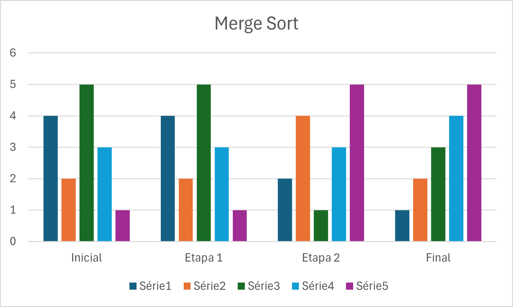

# Algoritmos de Busca & Ordenação

Este repositório contém uma série de implementações de algoritmos de busca e ordenação que fazem parte de um estudo para o curso de Estruturas de Dados de minha faculdade. Abaixo estão as descrições de alguns algoritmos implementados, comparações de desempenho e exemplos de uso.

# Algoritmos de Busca
- Binary Search
- Interpolation Search
- Jump Search
- Exponential Search
- Ternary Search

# Algoritmos de Ordenação

- Shell Sort
  - Shell
  - Knuth
  - Hibbard
- Merge Sort
- Selection Sort
- Bucket Sort
- Radix Sort
  - Base 10
  - Base 2
- Quick Sort
  - First Pivot
  - Middle Pivot
  - Last Pivot

# Algoritmo de Busca

#### Comparação de Tempo & Complexidade

<table>
 <tr>
  <td colspan="4" style="text-align: center;">Comparação de Tempo</td>
  <td colspan="3" style="text-align: center;">Complexidade de Tempo</td>
 </tr>
 <tr>
   <td>Algorithm</td>
   <td>Tempo de Execução - Lista Pequena</td>
   <td>Tempo de Execução - Lista Média</td>
   <td>Tempo de Execução - Lista Grande</td>
   <td>Melhor Caso</td>
   <td>Médio Caso</td>
   <td>Pior Caso</td>
   <td>Complexidade de Espaço</td>
 </tr>
 <tr>
   <td>Binary Search</td>
   <td>0,012787</td>
   <td>0,000107</td>
   <td>0,000048</td>
   <td>O(1)</td>
   <td>O(log n)</td>
   <td>O(log n)</td>
   <td>O(1)</td>
 </tr>
 <tr>
   <td>Interpolation Search</td>
   <td>0,000244</td>
   <td>0,000199</td>
   <td>0,000197</td>
   <td>O(1)</td>
   <td>O(n)</td>
   <td>O(log(log n))</td>
   <td>O(1)</td>
 </tr>
 <tr>
   <td>Jump Search</td>
   <td>0,000422</td>
   <td>0,000100</td>
   <td>0,000073</td>
   <td>O(√n)</td>
   <td>O(√n)</td>
   <td>O(√n)</td>
   <td>O(1)</td>
 </tr>
 <tr>
   <td>Exponential Search</td>
   <td>0,000265</td>
   <td>0,000068</td>
   <td>0,000174</td>
   <td> O(1)</td>
   <td>O(log n)</td>
   <td>O(log n)</td>
   <td>O(1)</td>
 </tr>
 <tr>
   <td>Ternary Search</td>
   <td>0,000243</td>
   <td>0,000178</td>
   <td>0,000096</td>
   <td> O(1)</td>
   <td>O(log₃ n)</td>
   <td>O(log₃ n)</td>
   <td>O(1)</td>
 </tr>
</table>

# Algoritmo de Ordenação

#### Comparação de Tempo & Complexidade

<table>
 <tr>
  <td colspan="4" style="text-align: center;">Comparação de Tempo</td>
  <td colspan="3" style="text-align: center;">Complexidade de Tempo</td>
 </tr>
 <tr>
   <td>Algoritmo</td>
   <td>Tempo de Execução</td>
   <td colspan="2">Numero de Comparação</td>
   <td>Melhor Caso</td>
   <td>Médio Caso</td>
   <td>Pior Caso</td>
   <td>Complexidade de Tempo</td>
 </tr>
 <tr>
   <td>Shell Sort (Knuth)</td>
   <td>0.000007</td>
   <td colspan="2">40</td>
   <td>O(n log n)</td>
   <td>-</td>
   <td>O(n^(3/2)</td>
   <td>O(1)</td>
 </tr>
 <tr>
   <td>Shell Sort (Shell)</td>
   <td>0.000008</td>
   <td colspan="2">36</td>
   <td>O(n log n)</td>
   <td>O(n^(3/2))</td>
   <td>O(n²)</td>
   <td>O(1)</td>
 </tr>
 <tr>
   <td>Quick Sort (Middle Pivot)</td>
   <td>0.000020</td>
   <td colspan="2">61</td>
   <td>O(log n)</td>
   <td>O(n log n)</td>
   <td>O(n²)</td>
   <td>O(log n)</td>
 </tr>
 <tr>
   <td>Radix Sort (Base 10)</td>
   <td>0.000020</td>
   <td colspan="2">88</td>
   <td>O(n * k)</td>
   <td>O(n * k)</td>
   <td>O(n * k)</td>
   <td>O(n + k)</td>
 </tr>
 <tr>
   <td>Quick Sort (First Pivot)</td>
   <td>0.000039</td>
   <td colspan="2">210</td>
   <td>O(log n)</td>
   <td>O(n log n)</td>
   <td>O(n²)</td>
   <td>O(log n)</td>
 </tr>
 <tr>
   <td>Quick Sort (Last Pivot)</td>
   <td>0.000043</td>
   <td colspan="2">210</td>
   <td>O(log n)</td>
   <td>O(n log n)</td>
   <td>O(n²)</td>
   <td>O(log n)</td>
 </tr>
 <tr>
   <td>Selection Sort</td>
   <td>0.000019</td>
   <td colspan="2">231</td>
   <td>O(n²)</td>
   <td>O(n²)</td>
   <td>O(n²)</td>
   <td>O(1)</td>
 </tr>
 <tr>
   <td>Bucket Sort</td>
   <td>0.000067</td>
   <td colspan="2">22</td>
   <td>O(n + k)</td>
   <td>O(n + k)</td>
   <td>O(n²)</td>
   <td>O(n + k)</td>
 </tr>
 <tr>
   <td>Merge Sort</td>
   <td>0.000095</td>
   <td colspan="2">76</td>
   <td>O(n log n)</td>
   <td>O(n log n)</td>
   <td>O(n log n)</td>
   <td>O(n)</td>
 </tr>
 <tr>
   <td>Radix Sort (Base 2)</td>
   <td>0.000070</td>
   <td colspan="2">308</td>
   <td>O(n * k)</td>
   <td>O(n * k)</td>
   <td>O(n * k)</td>
   <td>O(n + k)</td>
 </tr>
 <tr>
   <td>Shell Sort (Hibbard)</td>
   <td>0.002483</td>
   <td colspan="2">48</td>
   <td>O(n log n)</td>
   <td>O(n^(3/2))</td>
   <td>O(n²)</td>
   <td>O(1)</td>
 </tr>
</table>

# Estabilidade dos Algoritmos de Ordenação

### 1. Shell Sort
- **Estabilidade:** Não estável
- **Por quê?** Durante o processo de comparação de elementos em grandes intervalos, elementos iguais podem ser deslocados, alterando sua ordem relativa.
- **Exemplo:**
  - Original: [(3, A), (3, B), (2, C)]
  - Shell Sort: [(2, C), (3, B), (3, A)]
   
### 2. Merge Sort
- **Estabilidade:** Estável
- **Por quê?** Durante a intercalação de sub-arrays ordenados, os elementos iguais são copiados na ordem em que aparecem nos sub-arrays.
- **Exemplo:**
  - Original: [(3, A), (2, B), (3, C)]
  - Merge Sort: [(2, B), (3, A), (3, C)]

### 3. Selection Sort
- **Estabilidade:** Não estável
- **Por quê?** Durante o processo de troca do menor elemento com o elemento atual, a ordem relativa de elementos iguais pode mudar.
- **Exemplo:**
  - Original: [(3, A), (3, B), (2, C)]
  - Selection Sort: [(2, C), (3, B), (3, A)]

### 4. Bucket Sort
- **Estabilidade:** Estável (se o método usado dentro de cada balde for estável)
- **Por quê?** Elementos iguais caem no mesmo balde, e sua ordem relativa é preservada se o método de ordenação usado nos baldes for estável (por exemplo, Merge Sort).
- **Exemplo:**
  - Original: [(3, A), (3, B), (2, C)]
  - Bucket Sort: [(2, C), (3, A), (3, B)]

### 5. Radix Sort
- **Estabilidade:** Estável
- **Por quê?** Ele ordena os dígitos do menos significativo para o mais significativo, usando um algoritmo de ordenação estável (geralmente Counting Sort) em cada etapa.
- **Exemplo:**
  - Original: [(32, A), (32, B), (21, C)]
  - Radix Sort: [(21, C), (32, A), (32, B)]

### 6. Quick Sort
- **Estabilidade:** Não estável
- **Por quê?** Durante o particionamento, elementos iguais podem ser colocados em lados diferentes do pivô, alterando sua ordem relativa.
- **Exemplo:**
  - Original: [(3, A), (3, B), (2, C)]
  - Quick Sort: [(2, C), (3, B), (3, A)]

# Gráficos

Aqui está um gráfico de colunas representando os algoritmos de ordenação:

### Merge Sort

### Quick Sort

### Selection Sort

